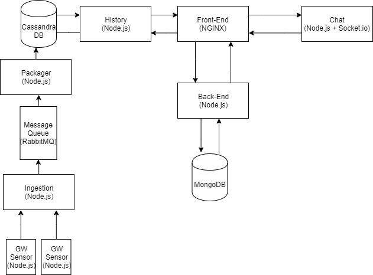

# Tasker

A computation management PaaS that optimizes tasks allocation for resource optimization.

## Full-stack of the application

The full-stack of our application consists of the following technologies.

### Front-end

The front-end of the application was created using Vue.js, a progressive front-end framework that natively supports the creation of single-page applications. Vue.js was chosen as it is one of the major web frameworks that have been getting traction recently, combining good practices and features from both Angular and React.

### Front-end server

NGINX was used in order to serve the static assets of the front-end. NGINX was chosen since it is a battle-tested solution that provides high performance in terms of number of requests.

### CSS-Framework

Google's materialize was chosen as the framework for the website as it is easy to use and adheres to good design practices that enforce concepts such as dynamic content and grids.

### Back-end

The back-end services were done using Express.js on top of Node.js. Node.js was chosen as it is asynchronous, a feature which is crucial in a web application. Multiple other backends were considered, however Node.js is scalable and easy to prototype, especially when coupled with Express.js; a web framework for Node.js.

### NoSQL databases

In order to store time-series data, CassandraDB was the obvious choice as it uses SSTables with consistent hashing, making it very fast and scalable in the context of our web application to store GW and CO2 values per server.

The servers and users of the application were stored in MongoDB. MongoDB seemed like a good choice since it uses a document-oriented approach to store its data, meaning that the data does not need to adhere to a particular structure as every document may have unique fields collectively which are bundled into a collection. This makes development process very fast and increases the overall scalability of the platform.

### Websockets

Socket.io was chosen to transfer messages between users and technical support. Socket.io is supported in JavaScript and provides well-structured documentation regarding its implementation.

### Data visualization

Chart.js was used to visualize the data of each server. Chart.js provides dynamic charts which can be updated on-the-fly.

### Message queue

Due to the fact that different sensors existed in our environment, piping values every time interval, a message queue was used to stream the data through data-specific queues. RabbitMQ provided an easy implementation towards this endeavour and was our choice of message queue.

### Ingestion service

Although in a real-world application a professional ingestion service, such as Apache Kafka, would be used it felt like overkill for the types of data that our infrastructure generated. As such, the ingestion service was a simple http server implemented in Node.js.

### Packager service

Before inserting the sensor values into CassandraDB, a intermediate service called a packager consumed the messages from the message queue. The packager's existence is crucial to not expose the database directly to outside sensors. Moreover, should one want to apply any kind of logic to the data generated by the sensors before storing the values into the database, they could.

### Sensors

Two sensors we created for the purposes of the website: co2-sensor, and gw-sensor. Per each server, these sensors generated values and streamed them to the ingestion service. Since we did not have physical sensors attached to actual servers, we emulated the sensors by using web-servers that generated random values per existing server.

### History service

In an attempt to increase the separation of concerns, a history retriever module was implemented that is able to get the Co2 and GW values from Cassandra. The motivation behind separating this service lies in the idea that being able to retrieve diagnostic information should not be implemented on the servers themselves. If a module breaks in the system that causes a server to go down, one should be able to diagnose the system by extracting all relevant information that might be useful. 

### Containerization service

Docker was the choice of the containerization service of choice.

### Orchestrator

Kubernetes was used as the container orchestrator. Deployments and services were build for all custom made docker images, except the $CO_{2}$-sensor and the energy consumption sensor (Gigawatt sensor; or GW-sensor). The two sensor types only required a deployment as they are not designed to receive data: they only send data to other services. For the databases, we used images for MongoDB and Cassandra found in the Google and Docker repositories. These were deployed using StatefulSets and headless Services. In the StatefulSets for these databases, PersistentVolumeClaims were specified to provision PersistentVolumes automatically and maintain the state of the database even if all nodes go down.

As a dashboard, the build in Minikube and Google Cloud dashboards were used. Since both of these services that we used offer dashboards for monitoring the state of the cluster, there was no need to implement a custom one. Minikube's dashboard can be launched by running "minikube dashboard", while Google's can be found after logging in to the Gougle Cloud website.

### Fault tolerance

In the event of a fault occurring with any service, certain measures were implemented to enable the continued operation of the platform.

Firstly, a set of replicas was deployed within Kubernetes. As such, multiple instances of the same service ran at the same time with a load balancer in front. Should a service crash, it would be restarted automatically by Kubernetes. 

Secondly, database replication was attempted both in MongoDB and CassandraDB. Replica sets were created for Mongo that would enable, in theory, data replication between nodes living in the Mongo cluster. In practice, we were unable to deploy the replica set within Kubernetes.

Thirdly, should a service stop operating for any reason, the rest of the platform would continue to work as intended (minus the functionality provided by the stopped service). If that service would be started again, the functionality would be regained. For a service that is dependent on the existence of a functional database, the service would regain functionality. This is ensured by attempting to reconnect to the database, should the service notice that it is down.

### System architecture
Every component runs in a docker container. On top of that, every container is orchestrated by Kubernetes which, in our testing, created 3 replicas per service. This number can be modified. Within Kubernetes lies a load balancer named ingress which directs traffic to appropriate services.  

